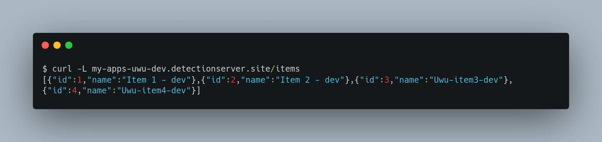

# DevOps Challenge Uwu
This repository contain an application that build with golang.   
https://my-apps-uwu-dev.detectionserver.site/items


### Tools
1. Kubernetes: 1.28
2. Terraform: 1.5.0
3. Helm: 3.11
4. Ansible: core2.15.8
5. Github Action
6. Github Private Registry
7. Sonarqube Community
8. Terragrunt: 0.55.11
9. Trivy


## Infrastructure Design
In the orchestration of my infrastructure, AWS stands as the foundational framework where the infrastructure is hosted. The application management is entrusted to EKS, a service adept at orchestrating containerized applications effortlessly. A meticulously crafted VPC comprises both public and private subnets, where the subtlety lies in the strategic placement of worker nodes secluded within the private domains. The orchestrating prowess extends further with the implementation of Load Balancers, facilitating seamless traffic direction to applications nestled within the cluster. The automation script unfolds with autoscaling, ensuring a dynamic equilibrium for the worker nodes in response to varying demand.


## Kubernetes Cluster
Within the intricate network of the cluster, an array of dependencies orchestrates the seamless flow of operations. The Ingress Nginx, an architectural linchpin, efficiently manages the ingress traffic, ensuring smooth navigation through the cluster's arteries. The load-balancing mantle rests upon the AWS Load Balancer Controller, consolidating external load-balancing functions into a singular entity within the cluster's domain. With the Cluster Autoscaler at the helm, node scaling becomes a fluid response to surges in traffic, maintaining equilibrium even amidst high-peak demands. To illuminate the infrastructure's performance metrics, the Metric Server stands vigilant, providing invaluable insights into system dynamics. In the realm of security, the Cert-Manager takes charge, expertly managing SSL certificate affairs. Finally, the deployment of Kube-Prom-Stack heralds a new era of monitoring prowess, ensuring a vigilant eye over the intricate fabric of the infrastructure.


## Terraform Code
In the orchestration of infrastructure provisioning, the choice of tools plays a pivotal role. Leveraging the robust foundation of official Terraform modules, the deployment of critical components like VPC, EKS, and EKS blueprint addons takes on a structured and reliable form. Terragrunt emerges as a strategic ally in this endeavor, wielding its prowess as a wrapper tool for Terraform. Its presence not only streamlines the intricacies of the code but also serves as a catalyst for simplicity in more complex design scenarios. Terragrunt's role is quintessential, introducing a layer of abstraction that promotes efficiency and clarity in the orchestration of intricate infrastructure landscapes. Also leverage remote backend to handle the locking and state management.

```bash
$ tree infra/terraform
.
infra/terraform
├── apps
│   ├── eks
│   │   └── terragrunt.hcl
│   └── eks-blueprint-addons
│       ├── terragrunt.hcl
│       ├── values-ingress.yaml
│       ├── values-metrics.yaml
│       └── values-mon.yaml
├── common_vars.hcl
├── misc
│   ├── db.tf
│   ├── s3.tf
│   └── terragrunt.hcl
├── terragrunt.hcl
└── vpc
    └── terragrunt.hcl
```

## Pipeline phase
I implement GitHub Actions for a streamlined CI/CD approach, organized into three essential pipelines. The pull request pipeline provides swift feedback for developers, ensuring quick insights into the impact of their changes. The main branch pipeline focuses on deploying a resilient application to production, while a dedicated rollback pipeline efficiently addresses unforeseen issues. The use of filters optimizes the process by triggering changes only when modifications occur in specific directories or services, enhancing precision and resource efficiency throughout the CI/CD lifecycle. Also we need to protect the main branch to only get new changes from Pull Request, and will reject a direct commit.

1. Main branch pipeline.
    * Purpose: End-to-end deployment of the application to production.
    * Steps:
        * Build the application.
        * Dockerize the application.
        * Deploy the application.
2. Pull request pipeline
    * Purpose: Validate changes before merging into the main branch.
    * Checks:
        * Test build
        * Linting to ensure code style and best practices.
        * Unit tests for functional validation.
        * Test build for Docker image.
        * Static Code Analytics.
        * Security check for Docker image vulnerabilities.
3. Rollback pipeline
    * Purpose: Rollback the application into the specific version.

## Deployment phase
The deployment process follows a structured workflow designed to ensure consistency and reliability across different environments. It initiates automatically upon code push to the main branch, with changes progressively promoted through dev, staging, and production environments.
In the deployment process, a rolling update approach is adopted to ensure seamless transitions. Helm charts serve as a fundamental tool to manage deployments. A base chart, accommodating Go application, is created to streamline maintenance, with the primary differentiator being the values files. While distinct values files are maintained for each environment, a singular general values file promotes consistency and simplifies overall management. The choice of distroless as the base image for runtime applications aligns with security best practices, aiming to reduce the attack surface. Applications run within containers under a non-root user, contributing to an additional layer of security. To orchestrate deployments, a dedicated deployer user is created. This user is assigned the responsibility of handling deployments to the Kubernetes cluster, enhancing security by segregating deployment tasks from other user roles.

## Rollback and versioning
The version is automatically generated based on the commit SHA short for each change in the main branch but in prod use git tag with semver. Rollback can be manually triggered, requiring the definition of a variable for specifying the rollback version.

## Future Improvement
1. Infrastructure Provisioning Repository -> Opting for a dedicated repository for infrastructure provisioning, with the flexibility to adopt a project-based infrastructure provisioning approach. This separation helps manage infrastructure changes independently from application code.
2. Deployment Strategies -> Implementing advanced deployment strategies such as blue-green and canary deployment, tailored to specific needs. These strategies enhance deployment safety, minimize downtime, and allow for controlled rollouts. We can use argocd and argo-rollouts.
3. Observability with Tracing/APM -> Integrating tracing and application performance monitoring (APM) using technologies like OpenTelemetry. This addition provides comprehensive observability into the application's behavior, aiding in debugging, performance optimization, and overall system health monitoring.
4. Secret Management -> To keep our sensitive information safe, we can use AWS Secret Manager or Parameter Store along with the External-Secrets operator inside our cluster. AWS Secret Manager is like a secure vault where we store important stuff, and External-Secrets helps us smoothly bring these secrets into our Kubernetes world. It's like having a super-secret locker for our passwords and keys, making sure everything stays safe and sound, both in AWS and Kubernetes.
5. Terragrunt improviement -> By using Terragrunt with a smart template design, we keep our Terraform code DRY even as the infrastructure gets more intricate. Terragrunt simplifies the complexity, ensuring our code remains clean, concise, and easy to manage as our infrastructure grows.
6. Alerting -> Implement complex and detail alerting system to ensure the availability and reliability of our infrastructure.
7. SSL Management -> Leverage ssl management such as cert-manager.
